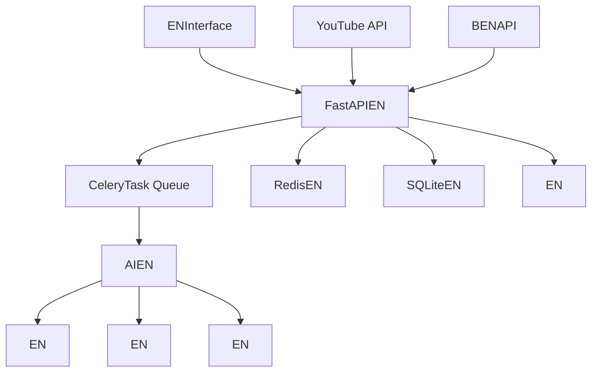

# AutoClip - EN

SupportYouTube/BEN、Auto Clipping、Smart CollectionsEN

[](https://python.org)
[](https://reactjs.org)
[](https://fastapi.tiangolo.com)
[](https://www.typescriptlang.org)
[](https://celeryproject.org)
[](LICENSE)

[](https://github.com/nd7hdyt/YtClipper)
[](https://github.com/nd7hdyt/YtClipper)
[](https://github.com/nd7hdyt/YtClipper/issues)

**Language**: [English](README-EN.md) | [Chinese](README.md)  

</div>

## 🎯 Project Overview

AutoClipENBased onAIENIntelligent Video ClippingProcessing System，ENYouTube、BENPlatform DownloadEN，ENAIEN，EN。ENAdoptsENFrontend-Backend SeparationEN，ProvidesIntuitiveENWebInterfaceENPowerfulENProcessing Capability。

### ✨ Core Features

- 🎬 **Multi-Platform Support**: YouTube、BENOne-Click Download，SupportLocal File Upload
- 🤖 **AIIntelligent Analysis**: Based onENLanguageEN
- ✂️ **Auto Clipping**: EN，SupportEN
- 📚 **Smart Collections**: AIEN，SupportEN
- 🚀 **Real-time Processing**: ENTask Queue，ENProgress Feedback，WebSocketCommunication
- 🎨 **Modern UI**: React + TypeScript + Ant Design，Responsive Design
- 📱 **Mobile Support**【In Development】: Responsive Design，In ProgressEN
- 🔐 **Account Management**【In Development】: SupportBENMulti-Account Management，ENHealth Check
- 📊 **Analytics**: ENProject ManagementENAnalyticsEN
- 🛠️ **Easy Deployment**: One-Click Start Script，DockerSupport，Detailed Docs
- 📤 **BENUpload**【In Development】: Auto UploadENBEN
- ✏️ **Subtitle Editing**【In Development】: VisualSubtitle EditingENSync

## 🏗️ System Architecture



### Tech Stack

#### Backend

- **FastAPI**: ENPython WebEN，ENAPIEN
- **Celery**: ENTask Queue，SupportEN
- **Redis**: EN，EN
- **SQLite**: EN，SupportENPostgreSQL
- **yt-dlp**: YouTubeEN，SupportEN
- **EN**: AIEN，SupportEN
- **WebSocket**: ENCommunication，EN
- **Pydantic**: EN

#### Frontend

- **React 18**: ENInterfaceEN，HooksEN
- **TypeScript**: EN，EN
- **Ant Design**: ENUIEN
- **Vite**: EN，EN
- **Zustand**: EN
- **React Router**: EN
- **Axios**: HTTPEN
- **React Player**: EN

## 🚀 Quick Start

### Requirements

#### DockerEN（EN）

- **Docker**: 20.10+
- **Docker Compose**: 2.0+
- **EN**: EN 4GB，EN 8GB+
- **EN**: EN 10GB EN

#### EN

- **EN**: macOS / Linux / Windows (WSL)
- **Python**: 3.8+ (EN 3.9+)
- **Node.js**: 16+ (EN 18+)
- **Redis**: 6.0+ (EN 7.0+)
- **FFmpeg**: EN
- **EN**: EN 4GB，EN 8GB+
- **EN**: EN 10GB EN

### One-Click Start

#### EN：DockerEN（EN）

```bash
# EN
git clone https://github.com/nd7hdyt/YtClipper.git
cd autoclip

# DockerOne-Click Start
./docker-start.sh

# EN
./docker-start.sh dev

# EN
./docker-stop.sh

# EN
./docker-status.sh
```

#### EN：EN

```bash
# EN
git clone https://github.com/nd7hdyt/YtClipper.git
cd autoclip

# One-Click Start（EN，EN）
./start_autoclip.sh

# EN（EN，EN）
./quick_start.sh

# EN
./status_autoclip.sh

# EN
./stop_autoclip.sh
```

### Manual Installation

```bash
# 1. EN
python3 -m venv venv
source venv/bin/activate  # Linux/macOS
# EN venv\Scripts\activate  # Windows

# 2. ENPythonEN
pip install -r requirements.txt

# 3. EN
cd frontend && npm install && cd ..

# 4. ENRedis
# macOS
brew install redis
brew services start redis

# Ubuntu/Debian
sudo apt update
sudo apt install redis-server
sudo systemctl start redis-server

# CentOS/RHEL
sudo yum install redis
sudo systemctl start redis

# 5. ENFFmpeg
# macOS
brew install ffmpeg

# Ubuntu/Debian
sudo apt install ffmpeg

# CentOS/RHEL
sudo yum install ffmpeg

# 6. EN
cp env.example .env
# EN .env EN，ENAPIEN
```

## 🎬 Feature Demo

### EN

1. **EN**
   - SupportYouTube、BEN
   - EN
   - SupportLocal File Upload

2. **AIIntelligent Analysis**
   - EN
   - EN
   - EN

3. **EN**
   - EN
   - EN
   - SupportEN

4. **EN**
   - WebSocketEN
   - EN
   - EN

5. **BENUploadEN**【In Development】
   - Auto UploadENBEN
   - SupportMulti-Account Management
   - ENUploadEN

6. **Subtitle EditingEN**【In Development】
   - VisualSubtitle EditingEN
   - EN
   - ENLanguageENSupport

## 📖 Usage Guide

### 1. EN

#### YouTubeEN

1. EN"EN"
2. EN"YouTubeEN"
3. ENURL
4. ENCookie（EN）
5. EN"EN"

#### BEN

1. EN"EN"
2. EN"BEN"
3. ENURL
4. ENAccount
5. EN"EN"

#### EN

1. EN"EN"
2. EN"ENUpload"
3. EN
4. UploadEN（EN）
5. EN"EN"

### 2. EN

EN：

1. **EN**: EN
2. **EN**: AIEN
3. **EN**: EN
4. **EN**: ENAIEN
5. **EN**: EN
6. **EN**: AIEN
7. **EN**: EN

### 3. EN

- **EN**: EN
- **EN**: EN、EN
- **EN**: ENAIEN
- **EN**: EN
- **BENUpload**【In Development】: ENUploadENBEN
- **Subtitle Editing**【In Development】: VisualEN

## 🔧 Configuration

### EN

EN `.env` EN：

```bash
# EN
DATABASE_URL=sqlite:///./data/autoclip.db

# RedisEN
REDIS_URL=redis://localhost:6379/0

# AI APIEN
API_DASHSCOPE_API_KEY=your_dashscope_api_key
API_MODEL_NAME=qwen-plus

# EN
LOG_LEVEL=INFO
ENVIRONMENT=development
DEBUG=true

# EN
UPLOAD_DIR=./data/uploads
PROJECT_DIR=./data/projects
```

### BENAccountEN【In Development】

1. EN"BENAccount Management"
2. EN：
   - **CookieEN**（EN）：ENCookie
   - **AccountEN**：ENAccountEN
   - **EN**：EN
3. ENAccountEN

## 📁 Project Structure

```text
autoclip/
├── backend/                 # EN
│   ├── api/                # APIEN
│   │   ├── v1/            # API v1EN
│   │   │   ├── youtube.py # YouTubeENAPI
│   │   │   ├── bilibili.py # BENAPI
│   │   │   ├── projects.py # Project ManagementAPI
│   │   │   ├── clips.py   # ENAPI
│   │   │   ├── collections.py # ENAPI
│   │   │   └── settings.py # ENAPI
│   │   └── upload_queue.py # UploadEN
│   ├── core/              # EN
│   │   ├── database.py    # EN
│   │   ├── celery_app.py  # CeleryEN
│   │   ├── config.py      # EN
│   │   └── llm_manager.py # AIEN
│   ├── models/            # EN
│   │   ├── project.py     # EN
│   │   ├── clip.py        # EN
│   │   ├── collection.py  # EN
│   │   └── bilibili.py    # BENAccountEN
│   ├── services/          # EN
│   │   ├── video_service.py # EN
│   │   ├── ai_service.py  # AIEN
│   │   └── upload_service.py # UploadEN
│   ├── tasks/             # CeleryEN
│   │   ├── processing.py  # EN
│   │   ├── upload.py      # UploadEN
│   │   └── maintenance.py # EN
│   ├── pipeline/          # EN
│   │   ├── step1_outline.py # EN
│   │   ├── step2_timeline.py # EN
│   │   ├── step3_scoring.py # EN
│   │   └── step6_video.py # EN
│   └── utils/             # EN
├── frontend/              # EN
│   ├── src/
│   │   ├── components/    # ReactEN
│   │   │   ├── UploadModal.tsx # UploadEN
│   │   │   ├── ClipCard.tsx # EN
│   │   │   ├── CollectionCard.tsx # EN
│   │   │   └── BilibiliManager.tsx # BEN
│   │   ├── pages/         # EN
│   │   │   ├── HomePage.tsx # EN
│   │   │   ├── ProjectDetailPage.tsx # EN
│   │   │   └── SettingsPage.tsx # EN
│   │   ├── services/      # APIEN
│   │   │   └── api.ts     # APIEN
│   │   └── stores/        # EN
│   └── package.json
├── data/                  # EN
│   ├── projects/          # EN
│   ├── uploads/           # UploadEN
│   ├── temp/              # EN
│   ├── output/            # EN
│   └── autoclip.db        # EN
├── scripts/               # EN
│   ├── start_autoclip.sh  # EN
│   ├── stop_autoclip.sh   # EN
│   └── status_autoclip.sh # EN
├── docs/                  # EN
│   ├── README.md          # EN
│   ├── i18n.md           # EN
│   └── *.md              # EN
├── logs/                  # EN
├── Dockerfile             # DockerEN
├── Dockerfile.dev         # ENDockerEN
├── docker-compose.yml     # ENDockerEN
├── docker-compose.dev.yml # ENDockerEN
├── docker-start.sh        # DockerEN
├── docker-stop.sh         # DockerEN
├── docker-status.sh       # DockerEN
├── .dockerignore          # DockerEN
├── DOCKER.md              # DockerEN
└── *.sh                   # EN
```

## 🌐 APIEN

ENAPIEN：

- **Swagger UI**: [http://localhost:8000/docs](http://localhost:8000/docs) (EN)
- **ReDoc**: [http://localhost:8000/redoc](http://localhost:8000/redoc) (EN)

### ENAPIEN

| EN | EN | EN |
|------|------|------|
| `/api/v1/projects` | GET | EN |
| `/api/v1/projects` | POST | EN |
| `/api/v1/projects/{id}` | GET | EN |
| `/api/v1/youtube/parse` | POST | ENYouTubeEN |
| `/api/v1/youtube/download` | POST | ENYouTubeEN |
| `/api/v1/bilibili/download` | POST | ENBEN |
| `/api/v1/projects/{id}/process` | POST | EN |
| `/api/v1/projects/{id}/status` | GET | EN |

## 🔍 Troubleshooting

### FAQ

#### 1. EN

```bash
# EN
lsof -i :8000  # EN
lsof -i :3000  # EN

# EN
kill -9 <PID>
```

#### 2. RedisEN

```bash
# ENRedisEN
redis-cli ping

# ENRedisEN
brew services start redis  # macOS
systemctl start redis      # Linux
```

#### 3. YouTubeEN

- EN
- ENyt-dlpEN：`pip install --upgrade yt-dlp`
- ENCookie
- EN

#### 4. BEN

- ENAccountEN
- ENAccountCookie
- EN

### EN

```bash
# EN
tail -f logs/*.log

# EN
tail -f logs/backend.log    # EN
tail -f logs/frontend.log   # EN
tail -f logs/celery.log     # Task QueueEN
```

### EN

```bash
# EN
./status_autoclip.sh

# EN
curl http://localhost:8000/api/v1/health/  # ENHealth Check
curl http://localhost:3000/                # EN
redis-cli ping                             # RedisEN
```

## 🛠️ Development Guide

### EN

```bash
# EN
source venv/bin/activate

# ENPythonEN
export PYTHONPATH="${PWD}:${PYTHONPATH}"

# EN
python -m uvicorn backend.main:app --reload --port 8000
```

### EN

```bash
# EN
cd frontend

# EN
npm run dev
```

### Celery Worker

```bash
# ENWorker（EN -Q：EN celery_app.task_routes EN，
# EN -Q EN worker EN `celery` EN，EN `processing` EN）
celery -A backend.core.celery_app worker --loglevel=info -Q celery,processing,video,notification,upload

# ENBeatEN
celery -A backend.core.celery_app beat --loglevel=info

# ENFlowerEN
celery -A backend.core.celery_app flower --port=5555
```

## 📊 Performance

### EN

1. **EN**
   - ENPostgreSQLENSQLite
   - EN
   - EN

2. **RedisEN**
   - EN
   - EN
   - EN

3. **CeleryEN**
   - EN
   - EN
   - EN

## 🔒 Security

### EN

1. **EN**
   - EN
   - EN
   - ENAPIEN

2. **EN**
   - EN
   - ENHTTPS
   - ENCORS

3. **EN**
   - EN
   - EN
   - EN

## 🚀 Deployment

### DockerEN

#### EN

```bash
# EN
git clone https://github.com/nd7hdyt/YtClipper.git
cd autoclip

# EN
cp env.example .env
# EN .env EN，EN

# EN
docker-compose up -d

# EN
docker-compose ps
```

#### EN

- **ENInterface**: [http://localhost:3000](http://localhost:3000) (EN)
- **ENAPI**: [http://localhost:8000](http://localhost:8000) (EN)
- **APIEN**: [http://localhost:8000/docs](http://localhost:8000/docs) (EN)
- **FlowerEN**: [http://localhost:5555](http://localhost:5555) (EN)

#### EN

```bash
# EN
docker-compose -f docker-compose.dev.yml up -d

# EN
docker-compose -f docker-compose.dev.yml logs -f
```

#### EN

ENDockerDeploymentENReference [DOCKER.md](DOCKER.md) EN。

### EN

```bash
# ENsystemdEN
sudo nano /etc/systemd/system/autoclip.service

[Unit]
Description=AutoClip Video Processing System
After=network.target redis.service

[Service]
Type=forking
User=autoclip
WorkingDirectory=/opt/autoclip
ExecStart=/opt/autoclip/start_autoclip.sh
ExecStop=/opt/autoclip/stop_autoclip.sh
Restart=always

[Install]
WantedBy=multi-user.target
```

## 📈 Roadmap

### EN

- [ ] **BENUploadEN**: Auto UploadENBEN，SupportMulti-Account Management
- [ ] **Subtitle EditingEN**: VisualSubtitle EditingENSync
- [ ] **ENLanguageSupport**: SupportENLanguageEN
- [ ] **EN**: EN
- [ ] **EN**: SupportEN
- [ ] **APIEN**: ProvidesENAPIEN
- [ ] **EN**: EN

### Long-term Plan

- [ ] **AIEN**: ENAIEN
- [ ] **EN**: SupportEN
- [ ] **EN**: SupportEN
- [ ] **EN**: EN

## 🤝 Contributing

EN！EN、EN、EN。

### EN

1. **Fork** ENGitHubEN
2. ENForkEN：

   ```bash
   git clone https://github.com/nd7hdyt/YtClipper.git
   cd autoclip
   ```

3. EN：

   ```bash
   git checkout -b feature/amazing-feature
   ```

4. EN
5. EN：

   ```bash
   git add .
   git commit -m 'feat: add amazing feature'
   ```

6. EN：

   ```bash
   git push origin feature/amazing-feature
   ```

7. ENGitHubEN **Pull Request**

### EN

#### EN

- EN：ENPEP 8 PythonEN
- EN：ENTypeScript，ENESLintEN
- EN：EN（feat, fix, docs, style, refactor, test, chore）

#### EN

1. EN
2. EN
3. EN
4. EN

#### EN

```text
<type>(<scope>): <description>

[optional body]

[optional footer(s)]
```

EN：

- `feat(api): add video download endpoint`
- `fix(ui): resolve upload modal display issue`
- `docs(readme): update installation instructions`

## 📄 License

ENAdopts [MIT License](LICENSE) License。

## ❓ FAQ

### EN

**Q: EN？**
A: EN：

```bash
# EN
lsof -i :8000  # EN
lsof -i :3000  # EN

# EN
kill -9 <PID>
```

**Q: RedisEN？**
A: ENRedisEN：

```bash
# ENRedisEN
redis-cli ping

# ENRedisEN
brew services start redis  # macOS
sudo systemctl start redis-server  # Linux
```

**Q: EN？**
A: EN：

```bash
cd frontend
rm -rf node_modules package-lock.json
npm cache clean --force
npm install
```

### EN

**Q: YouTubeEN？**
A:

1. EN
2. ENyt-dlp：`pip install --upgrade yt-dlp`
3. ENCookie
4. EN

**Q: BEN？**
A:

1. ENAccountEN
2. ENAccountCookie
3. EN
4. ENAccount

**Q: AIEN？**
A:

1. ENAPIEN
2. EN（ENchunk_size）
3. EN
4. ENAIEN

**Q: BENUploadEN？**
A: BENUploadENIn Development，EN。ENSupport：

- Auto UploadENBEN
- Multi-Account ManagementEN
- ENUploadEN
- UploadEN

**Q: Subtitle EditingEN？**
A: Subtitle EditingENIn Development，EN。ENSupport：

- VisualSubtitle EditingEN
- EN
- ENLanguageENSupport
- EN

### Performance

**Q: EN？**
A:

1. ENCelery WorkerEN
2. ENSSDEN
3. EN
4. EN

**Q: EN？**
A:

1. EN
2. EN
3. EN
4. EN

## 📞 Support & Feedback

### EN

- **EN**: [GitHub Issues](https://github.com/nd7hdyt/YtClipper/issues)
- **EN**: [GitHub Discussions](https://github.com/nd7hdyt/YtClipper/discussions)
  (EN)
- **BugEN**: ENGitHub IssuesEN
- **EN**: [EN](docs/)

### ContactEN

EN，ENContact：

### 💬 QQ


### 📱 EN


### 📧 ENContactEN

- EN [GitHub Issue](https://github.com/nd7hdyt/YtClipper/issues)
- EN：[christine_zhouye@163.com](mailto:christine_zhouye@163.com)
- ENQQENContact

## 🙏 Acknowledgments

ENSupport：

### ENTech Stack

- [FastAPI](https://fastapi.tiangolo.com/) - ENPython WebEN
- [React](https://reactjs.org/) - ENInterfaceEN
- [Ant Design](https://ant.design/) - ENUIENLanguage
- [TypeScript](https://typescriptlang.org/) - JavaScriptEN
- [Celery](https://docs.celeryproject.org/) - ENTask Queue
- [Redis](https://redis.io/) - EN

### EN

- [yt-dlp](https://github.com/yt-dlp/yt-dlp) - YouTubeEN
- [FFmpeg](https://ffmpeg.org/) - EN

### AIEN

- [EN](https://tongyi.aliyun.com/) - ENLanguageEN
- [DashScope](https://dashscope.aliyun.com/) - ENAIEN

### EN

- [Vite](https://vitejs.dev/) - EN
- [Zustand](https://github.com/pmndrs/zustand) - EN
- [Pydantic](https://pydantic-docs.helpmanual.io/) - EN

### EN

- EN
- ProvidesEN
- EN

---

## EN，EN ⭐ Star

[](https://star-history.com/#nd7hdyt/YtClipper&Date)

Made with ❤️ by AutoClip Team

⭐ EN，ENStarSupportEN！
