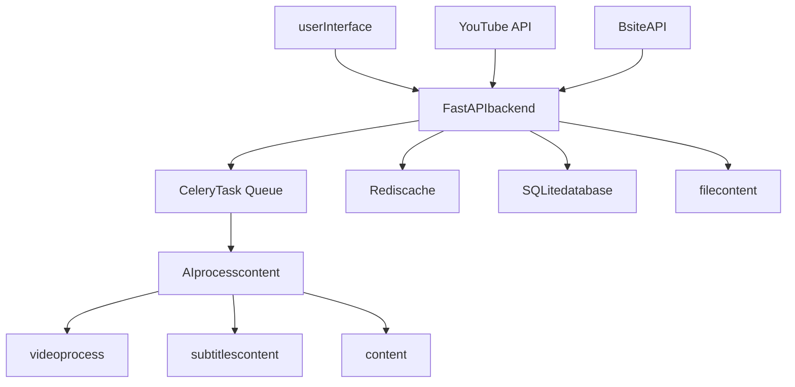

# AutoClip - videocontentclipcontenttool

supportYouTube/Bsitevideodownload、Auto Clipping、Smart Collectionscontent

[](https://python.org)
[](https://reactjs.org)
[](https://fastapi.tiangolo.com)
[](https://www.typescriptlang.org)
[](https://celeryproject.org)
[](LICENSE)

[](https://github.com/zhouxiaoka/autoclip)
[](https://github.com/zhouxiaoka/autoclip)
[](https://github.com/zhouxiaoka/autoclip/issues)

**Language**: [English](README-EN.md) | [content](README.md)  

</div>

## 🎯 Project Overview

AutoClipIsone Based onAI'sIntelligent Video ClippingProcessing System，contentfromYouTube、Bsiteetc.Platform Downloadvideo，contentAIcontent，contentcollection。SystemAdoptscontent'sFrontend-Backend Separationcontent，ProvidesIntuitive'sWebInterfaceAndPowerfulbackendProcessing Capability。

### ✨ Core Features

- 🎬 **Multi-Platform Support**: YouTube、BsitevideoOne-Click Download，supportLocal File Upload
- 🤖 **AIIntelligent Analysis**: Based oncontentLanguagemodel'svideocontent
- ✂️ **Auto Clipping**: content，supportmulticontentvideocontent
- 📚 **Smart Collections**: AIrecommendAndcontentcreatevideocollection，supportcontent
- 🚀 **Real-time Processing**: contentTask Queue，contentProgress Feedback，WebSocketCommunication
- 🎨 **Modern UI**: React + TypeScript + Ant Design，Responsive Design
- 📱 **Mobile Support**【In Development】: Responsive Design，In Progresscontent
- 🔐 **Account Management**【In Development】: supportBsiteMulti-Account Management，contentHealth Check
- 📊 **Analytics**: content'sProject ManagementAndAnalyticsfeature
- 🛠️ **Easy Deployment**: One-Click Startcontent，Dockersupport，contentdocs
- 📤 **BsiteUpload**【In Development】: Auto UploadclipvideocontentBsite
- ✏️ **Subtitle Editing**【In Development】: VisualSubtitle EditingAndcontentfeature

## 🏗️ System Architecture



### Tech Stack

#### Backend

- **FastAPI**: contentPython Webcontent，contentAPIdocscontent
- **Celery**: contentTask Queue，supportcontentprocess
- **Redis**: contentAndcache，taskstatuscontent
- **SQLite**: contentdatabase，supportcontentPostgreSQL
- **yt-dlp**: YouTubevideodownload，supportmulticontentformat
- **content**: AIcontent，supportmulticontentmodel
- **WebSocket**: contentCommunication，progresscontent
- **Pydantic**: contentverifyAndcontent

#### Frontend

- **React 18**: userInterfacecontent，HooksAndcontent
- **TypeScript**: content，content'scontent
- **Ant Design**: contentUIcontent
- **Vite**: contenttool，content
- **Zustand**: contentstatuscontent
- **React Router**: content
- **Axios**: HTTPcontent
- **React Player**: videocontent

## 🚀 Quick Start

### Requirements

#### Dockercontent（recommend）

- **Docker**: 20.10+
- **Docker Compose**: 2.0+
- **content**: content 4GB，recommend 8GB+
- **content**: content 10GB canusecontent

#### localcontent

- **contentSystem**: macOS / Linux / Windows (WSL)
- **Python**: 3.8+ (recommend 3.9+)
- **Node.js**: 16+ (recommend 18+)
- **Redis**: 6.0+ (recommend 7.0+)
- **FFmpeg**: videoprocessdependencies
- **content**: content 4GB，recommend 8GB+
- **content**: content 10GB canusecontent

### One-Click Start

#### contentone：Dockercontent（recommend）

```bash
# contentproject
git clone https://github.com/zhouxiaoka/autoclip.git
cd autoclip

# DockerOne-Click Start
./docker-start.sh

# contentstart
./docker-start.sh dev

# contentservice
./docker-stop.sh

# checkservicestatus
./docker-status.sh
```

#### content：localcontent

```bash
# contentproject
git clone https://github.com/zhouxiaoka/autoclip.git
cd autoclip

# One-Click Start（recommend，PackageincludecontentcheckAndmonitor）
./start_autoclip.sh

# contentstart（content，skipcontentcheck）
./quick_start.sh

# checkSystemstatus
./status_autoclip.sh

# contentSystem
./stop_autoclip.sh
```

### Manual Installation

```bash
# 1. createcontent
python3 -m venv venv
source venv/bin/activate  # Linux/macOS
# or venv\Scripts\activate  # Windows

# 2. installPythondependencies
pip install -r requirements.txt

# 3. installfrontenddependencies
cd frontend && npm install && cd ..

# 4. installRedis
# macOS
brew install redis
brew services start redis

# Ubuntu/Debian
sudo apt update
sudo apt install redis-server
sudo systemctl start redis-server

# CentOS/RHEL
sudo yum install redis
sudo systemctl start redis

# 5. installFFmpeg
# macOS
brew install ffmpeg

# Ubuntu/Debian
sudo apt install ffmpeg

# CentOS/RHEL
sudo yum install ffmpeg

# 6. configcontent
cp env.example .env
# content .env file，contentAPIkeyetc.config
```

## 🎬 Feature Demo

### contentfeaturecontent

1. **videodownloadandprocess**
   - supportYouTube、Bsitevideocontent
   - contentdownloadvideoAndsubtitlesfile
   - supportLocal File Upload

2. **AIIntelligent Analysis**
   - contentvideocontent
   - content
   - content

3. **videoclipandcollection**
   - content
   - contentrecommendcollectioncontent
   - supportcontentAndcontent

4. **contentprogressmonitor**
   - WebSocketcontentprogresscontent
   - content'staskstatuscontent
   - errorprocessAndcontent

5. **BsiteUploadfeature**【In Development】
   - Auto UploadclipvideocontentBsite
   - supportMulti-Account Management
   - contentUploadAndcontent

6. **Subtitle Editingfeature**【In Development】
   - VisualSubtitle Editingcontent
   - subtitlescontentAndcontent
   - multiLanguagesubtitlessupport

## 📖 Usage Guide

### 1. videodownload

#### YouTubevideo

1. incontentclick"contentproject"
2. Selectselect"YouTubecontent"
3. contentvideoURL
4. SelectselectcontentCookie（canSelect）
5. click"contentdownload"

#### Bsitevideo

1. incontentclick"contentproject"
2. Selectselect"Bsitecontent"
3. contentvideoURL
4. SelectselectcontentAccount
5. click"contentdownload"

#### localfile

1. incontentclick"contentproject"
2. Selectselect"fileUpload"
3. contentorSelectselectvideofile
4. Uploadsubtitlesfile（canSelect）
5. click"contentprocess"

### 2. contentprocess

Systemcontentstep：

1. **content**: downloadvideoAndsubtitlesfile
2. **content**: AIcontentvideocontentAndcontentinfo
3. **content**: content
4. **content**: contentper contentAIcontent
5. **content**: content
6. **collectionrecommend**: AIrecommendvideocollection
7. **videocontent**: contentclipvideoAndcollectionvideo

### 3. content

- **contentclip**: inprojectcontent'svideocontent
- **contentinfo**: content、contentetc.info
- **createcollection**: contentcreateoruseAIrecommend'scollection
- **downloadexport**: downloadcontent contentorcontentcollection
- **BsiteUpload**【In Development】: onecontentUploadclipvideocontentBsite
- **Subtitle Editing**【In Development】: VisualcontentAndcontentsubtitlesfile

## 🔧 Configuration

### contentconfig

create `.env` file：

```bash
# databaseconfig
DATABASE_URL=sqlite:///./data/autoclip.db

# Redisconfig
REDIS_URL=redis://localhost:6379/0

# AI APIconfig
API_DASHSCOPE_API_KEY=your_dashscope_api_key
API_MODEL_NAME=qwen-plus

# logsconfig
LOG_LEVEL=INFO
ENVIRONMENT=development
DEBUG=true

# filecontent
UPLOAD_DIR=./data/uploads
PROJECT_DIR=./data/projects
```

### BsiteAccountconfig【In Development】

1. inSettings pagecontentclick"BsiteAccount Management"
2. Selectselectcontent：
   - **Cookieimport**（recommend）：fromcontentexportCookie
   - **Accountcontent**：contentAccountcontent
   - **content**：content
3. addsucceededcontentSystemcontentAccountcontentstatus

## 📁 Project Structure

```text
autoclip/
├── backend/                 # backendcontent
│   ├── api/                # APIcontent
│   │   ├── v1/            # API v1version
│   │   │   ├── youtube.py # YouTubedownloadAPI
│   │   │   ├── bilibili.py # BsitedownloadAPI
│   │   │   ├── projects.py # Project ManagementAPI
│   │   │   ├── clips.py   # videocontentAPI
│   │   │   ├── collections.py # collectioncontentAPI
│   │   │   └── settings.py # SystemsettingsAPI
│   │   └── upload_queue.py # Uploadcontent
│   ├── core/              # contentconfig
│   │   ├── database.py    # databaseconfig
│   │   ├── celery_app.py  # Celeryconfig
│   │   ├── config.py      # Systemconfig
│   │   └── llm_manager.py # AImodelcontent
│   ├── models/            # contentmodel
│   │   ├── project.py     # projectmodel
│   │   ├── clip.py        # contentmodel
│   │   ├── collection.py  # collectionmodel
│   │   └── bilibili.py    # BsiteAccountmodel
│   ├── services/          # content
│   │   ├── video_service.py # videoprocessservice
│   │   ├── ai_service.py  # AIcontentservice
│   │   └── upload_service.py # Uploadservice
│   ├── tasks/             # Celerytask
│   │   ├── processing.py  # processtask
│   │   ├── upload.py      # Uploadtask
│   │   └── maintenance.py # contenttask
│   ├── pipeline/          # processcontent
│   │   ├── step1_outline.py # content
│   │   ├── step2_timeline.py # content
│   │   ├── step3_scoring.py # content
│   │   └── step6_video.py # videocontent
│   └── utils/             # toolcontent
├── frontend/              # frontendcontent
│   ├── src/
│   │   ├── components/    # Reactcontent
│   │   │   ├── UploadModal.tsx # Uploadcontent
│   │   │   ├── ClipCard.tsx # content
│   │   │   ├── CollectionCard.tsx # collectioncontent
│   │   │   └── BilibiliManager.tsx # Bsitecontent
│   │   ├── pages/         # content
│   │   │   ├── HomePage.tsx # content
│   │   │   ├── ProjectDetailPage.tsx # projectcontent
│   │   │   └── SettingsPage.tsx # Settings pagecontent
│   │   ├── services/      # APIservice
│   │   │   └── api.ts     # APIcontent
│   │   └── stores/        # statuscontent
│   └── package.json
├── data/                  # content
│   ├── projects/          # projectcontent
│   ├── uploads/           # Uploadfile
│   ├── temp/              # contentfile
│   ├── output/            # contentfile
│   └── autoclip.db        # databasefile
├── scripts/               # toolcontent
│   ├── start_autoclip.sh  # startcontent
│   ├── stop_autoclip.sh   # content
│   └── status_autoclip.sh # statuscheck
├── docs/                  # docs
│   ├── README.md          # docscontent
│   ├── i18n.md           # contentconfig
│   └── *.md              # contentdocs
├── logs/                  # logsfile
├── Dockerfile             # Dockercontentfile
├── Dockerfile.dev         # contentDockerfile
├── docker-compose.yml     # contentDockercontent
├── docker-compose.dev.yml # contentDockercontent
├── docker-start.sh        # Dockerstartcontent
├── docker-stop.sh         # Dockercontent
├── docker-status.sh       # Dockerstatuscheckcontent
├── .dockerignore          # Dockercontentfile
├── DOCKER.md              # Dockercontentdocs
└── *.sh                   # startcontent
```

## 🌐 APIdocs

startSystemcontentAPIdocs：

- **Swagger UI**: [http://localhost:8000/docs](http://localhost:8000/docs) (localcontent)
- **ReDoc**: [http://localhost:8000/redoc](http://localhost:8000/redoc) (localcontent)

### contentAPIcontent

| content | content | content |
|------|------|------|
| `/api/v1/projects` | GET | fetchprojectlist |
| `/api/v1/projects` | POST | createcontentproject |
| `/api/v1/projects/{id}` | GET | fetchprojectcontent |
| `/api/v1/youtube/parse` | POST | contentYouTubevideoinfo |
| `/api/v1/youtube/download` | POST | downloadYouTubevideo |
| `/api/v1/bilibili/download` | POST | downloadBsitevideo |
| `/api/v1/projects/{id}/process` | POST | contentprocessproject |
| `/api/v1/projects/{id}/status` | GET | fetchprocessstatus |

## 🔍 Troubleshooting

### FAQ

#### 1. contentuse

```bash
# checkcontentuse
lsof -i :8000  # backendcontent
lsof -i :3000  # frontendcontent

# contentuseprocess
kill -9 <PID>
```

#### 2. Redisconnectfailed

```bash
# checkRedisstatus
redis-cli ping

# startRedisservice
brew services start redis  # macOS
systemctl start redis      # Linux
```

#### 3. YouTubedownloadfailed

- checkcontentconnect
- updateyt-dlpversion：`pip install --upgrade yt-dlp`
- contentusecontentCookie
- checkvideoIscontentcanuse

#### 4. Bsitedownloadfailed

- checkAccountcontentstatus
- updateAccountCookie
- checkvideocontentsettings

### logscontent

```bash
# contentlogs
tail -f logs/*.log

# contentservicelogs
tail -f logs/backend.log    # backendlogs
tail -f logs/frontend.log   # frontendlogs
tail -f logs/celery.log     # Task Queuelogs
```

### Systemstatuscheck

```bash
# contentstatuscheck
./status_autoclip.sh

# contentcheckservice
curl http://localhost:8000/api/v1/health/  # backendHealth Check
curl http://localhost:3000/                # frontendcontenttest
redis-cli ping                             # Redisconnecttest
```

## 🛠️ Development Guide

### backendcontent

```bash
# content
source venv/bin/activate

# settingsPythonpath
export PYTHONPATH="${PWD}:${PYTHONPATH}"

# startbackendcontentservicecontent
python -m uvicorn backend.main:app --reload --port 8000
```

### frontendcontent

```bash
# contentfrontenddirectory
cd frontend

# startcontentservicecontent
npm run dev
```

### Celery Worker

```bash
# startWorker（content -Q：taskby celery_app.task_routes contentusecontent，
# content -Q 's worker contentdefault `celery` content，contenttaskcontentonecontentin `processing` content）
celery -A backend.core.celery_app worker --loglevel=info -Q celery,processing,video,notification,upload

# startBeatcontent
celery -A backend.core.celery_app beat --loglevel=info

# startFlowermonitor
celery -A backend.core.celery_app flower --port=5555
```

## 📊 Performance

### contentconfig

1. **databasecontent**
   - usePostgreSQLcontentSQLite
   - configconnectcontent
   - contentusecontentcache

2. **Rediscontent**
   - configcontent
   - contentusecontent
   - settingscontent

3. **Celerycontent**
   - content
   - configtaskcontent
   - contentusecontentbackend

## 🔒 Security

### content

1. **content**
   - usecontent
   - contentkey
   - contentAPIcontent

2. **content**
   - configcontent
   - useHTTPS
   - contentCORS

3. **content**
   - content
   - content
   - content

## 🚀 Deployment

### Dockercontent

#### contentstart

```bash
# contentproject
git clone https://github.com/zhouxiaoka/autoclip.git
cd autoclip

# configcontent
cp env.example .env
# content .env file，content'sconfig

# startcontentservice
docker-compose up -d

# contentservicestatus
docker-compose ps
```

#### contentservice

- **frontendInterface**: [http://localhost:3000](http://localhost:3000) (localcontent)
- **backendAPI**: [http://localhost:8000](http://localhost:8000) (localcontent)
- **APIdocs**: [http://localhost:8000/docs](http://localhost:8000/docs) (localcontent)
- **Flowermonitor**: [http://localhost:5555](http://localhost:5555) (localcontent)

#### content

```bash
# usecontentconfig
docker-compose -f docker-compose.dev.yml up -d

# contentlogs
docker-compose -f docker-compose.dev.yml logs -f
```

#### content

content'sDockerDeploymentcontentReference [DOCKER.md](DOCKER.md) docs。

### Systemservice

```bash
# createsystemdservicefile
sudo nano /etc/systemd/system/autoclip.service

[Unit]
Description=AutoClip Video Processing System
After=network.target redis.service

[Service]
Type=forking
User=autoclip
WorkingDirectory=/opt/autoclip
ExecStart=/opt/autoclip/start_autoclip.sh
ExecStop=/opt/autoclip/stop_autoclip.sh
Restart=always

[Install]
WantedBy=multi-user.target
```

## 📈 Roadmap

### content

- [ ] **BsiteUploadfeature**: Auto UploadclipvideocontentBsite，supportMulti-Account Management
- [ ] **Subtitle Editingfeature**: VisualSubtitle EditingcontentAndcontentfeature
- [ ] **multiLanguagesupport**: supportcontentmultiLanguage'svideoprocess
- [ ] **content**: contentservice
- [ ] **contentprocess**: supportcontentvideoprocess
- [ ] **APIcontent**: ProvidescontentAPIcontent
- [ ] **contentuse**: contentuse

### Long-term Plan

- [ ] **AImodelcontent**: contentmultiAImodel
- [ ] **content**: supportmultiusercontent
- [ ] **contentSystem**: supportNo.content
- [ ] **content**: contentfeatureAndservice

## 🤝 Contributing

content'scontent！contentIscontent、docscontent、issuecontentIsfeaturecontent。

### ifcontent

1. **Fork** projectcontent'sGitHubcontent
2. content'sForkcontentlocal：

   ```bash
   git clone https://github.com/zhouxiaoka/autoclip.git
   cd autoclip
   ```

3. createfeaturecontent：

   ```bash
   git checkout -b feature/amazing-feature
   ```

4. contentAndtest
5. content：

   ```bash
   git add .
   git commit -m 'feat: add amazing feature'
   ```

6. content：

   ```bash
   git push origin feature/amazing-feature
   ```

7. inGitHubcontentcreate **Pull Request**

### content

#### content

- backend：contentPEP 8 Pythoncontent
- frontend：useTypeScript，contentESLintcontent
- contentinfo：usecontentformat（feat, fix, docs, style, refactor, test, chore）

#### content

1. ensurecontenttestcontent
2. addcontent'stestusecontent
3. updatecontentdocs
4. ensurecontentcheckcontent

#### contentinfoformat

```text
<type>(<scope>): <description>

[optional body]

[optional footer(s)]
```

content：

- `feat(api): add video download endpoint`
- `fix(ui): resolve upload modal display issue`
- `docs(readme): update installation instructions`

## 📄 License

contentprojectAdopts [MIT License](LICENSE) License。

## ❓ FAQ

### installAndstartissue

**Q: startcontentusecontent？**
A: usecontentcheckcontentusecontent'sprocess：

```bash
# checkcontentuse
lsof -i :8000  # backendcontent
lsof -i :3000  # frontendcontent

# contentprocess
kill -9 <PID>
```

**Q: Redisconnectfailedcontent？**
A: ensureRedisservicecontentincontent：

```bash
# checkRedisstatus
redis-cli ping

# startRedisservice
brew services start redis  # macOS
sudo systemctl start redis-server  # Linux
```

**Q: frontenddependenciesinstallfailedcontent？**
A: contentcleancachecontentinstall：

```bash
cd frontend
rm -rf node_modules package-lock.json
npm cache clean --force
npm install
```

### featureuseissue

**Q: YouTubevideodownloadfailedcontent？**
A:

1. checkcontentconnect
2. updateyt-dlp：`pip install --upgrade yt-dlp`
3. contentusecontentCookie
4. checkvideoIscontentcanuseorcontent

**Q: Bsitevideodownloadfailedcontent？**
A:

1. checkAccountcontentstatus
2. updateAccountCookie
3. checkvideocontentsettings
4. contentusecontentAccount

**Q: AIprocesscontent？**
A:

1. checkAPIkeyconfig
2. contentprocesscontent（contentchunk_size）
3. checkcontentconnect
4. contentusecontent'sAImodel

**Q: BsiteUploadfeaturecontentcancontentuse？**
A: BsiteUploadfeaturecontentinIn Development，contentincontentone versioncontentRelease。contentfeaturecontentsupport：

- Auto UploadclipvideocontentBsite
- Multi-Account ManagementAndcontent
- contentUploadAndcontent
- Uploadprogressmonitor

**Q: Subtitle Editingfeaturecontentcancontentuse？**
A: Subtitle EditingfeaturecontentinIn Development，contentincontentone versioncontentRelease。contentfeaturecontentsupport：

- VisualSubtitle Editingcontent
- subtitlescontent
- multiLanguagesubtitlessupport
- subtitlesformatcontent

### Performance

**Q: ifcontentprocesscontent？**
A:

1. contentCelery Workercontent
2. useSSDcontent
3. contentSystemcontent
4. contentvideocontentsettings

**Q: ifcontentuse？**
A:

1. contentclean temp files
2. contentvideo
3. deleteNo need'sproject
4. usecontent

## 📞 Support & Feedback

### fetchcontent

- **issuecontent**: [GitHub Issues](https://github.com/zhouxiaoka/autoclip/issues)
- **featurecontent**: [GitHub Discussions](https://github.com/zhouxiaoka/autoclip/discussions)
  (contentcreatecontentcanuse)
- **Bugcontent**: contentuseGitHub Issuescontent
- **docs**: [projectdocs](docs/)

### Contactcontent

ifcontentissueorcontent，contentContact：

### 💬 QQ


### 📱 content


### 📧 contentContactcontent

- content [GitHub Issue](https://github.com/zhouxiaoka/autoclip/issues)
- content：[christine_zhouye@163.com](mailto:christine_zhouye@163.com)
- addcontentQQorcontentContact

## 🙏 Acknowledgments

contentprojectAndservice'ssupport：

### contentTech Stack

- [FastAPI](https://fastapi.tiangolo.com/) - contentPython Webcontent
- [React](https://reactjs.org/) - userInterfacecontent
- [Ant Design](https://ant.design/) - contentUIcontentLanguage
- [TypeScript](https://typescriptlang.org/) - JavaScript'scontent
- [Celery](https://docs.celeryproject.org/) - contentTask Queue
- [Redis](https://redis.io/) - content

### videoprocess

- [yt-dlp](https://github.com/yt-dlp/yt-dlp) - YouTubevideodownloadtool
- [FFmpeg](https://ffmpeg.org/) - contentvideoprocesscontent

### AIservice

- [content](https://tongyi.aliyun.com/) - contentLanguagemodelservice
- [DashScope](https://dashscope.aliyun.com/) - contentAIservicecontent

### contenttool

- [Vite](https://vitejs.dev/) - frontendcontenttool
- [Zustand](https://github.com/pmndrs/zustand) - statuscontent
- [Pydantic](https://pydantic-docs.helpmanual.io/) - contentverifycontent

### content

- content'scontent
- ProvidescontentAndcontent'suser
- contentandtestAndcontent'scontent

---

## ifcontentthis projectcontent，contentone  ⭐ Star

[](https://star-history.com/#zhouxiaoka/autoclip&Date)

Made with ❤️ by AutoClip Team

⭐ ifcontentuse，content Starsupportonecontent！
